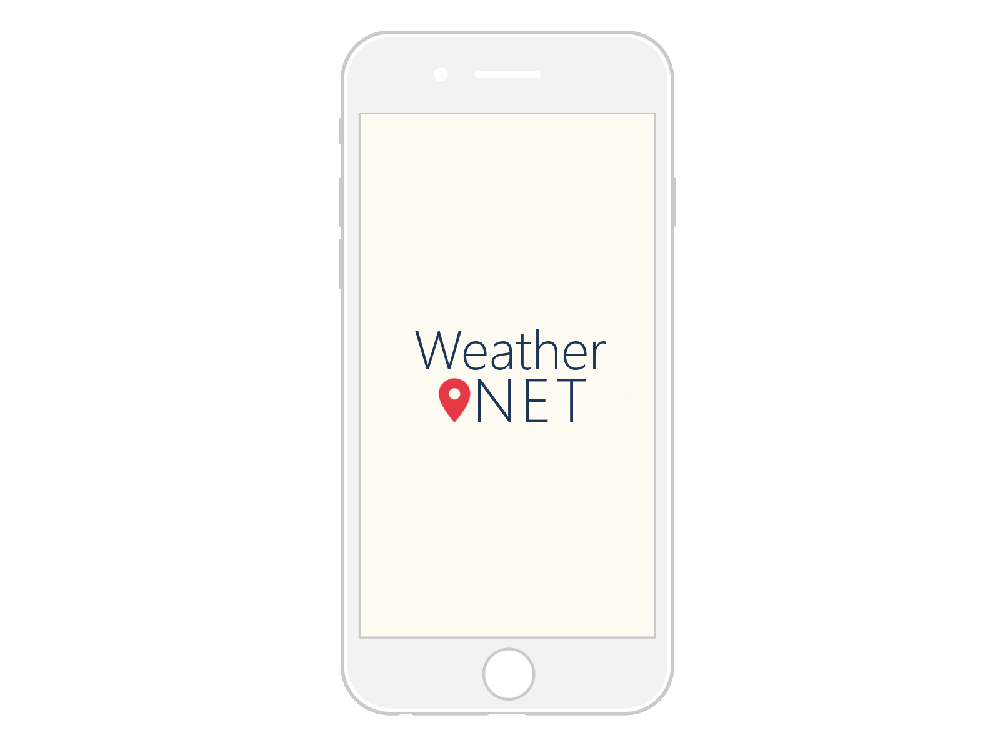

# WeatherNET- eine interaktive Wetterapp:

    Projekt der LVA Multimediasysteme im SS2019 @JKULinz
    Team:
    - Reisinger Philipp (k11802930)
    - Schropp Sarah (k11771533)
    - Schwap Tobias (k11773648)

### Projektbeschreibung!

In herkömmlichen Wetter Apps werden meist nur punktuelle Messungen einbezogen und graphisch dargestellt, sowie Prognosen angezeigt. 
Wir möchten dieses Konzept erweitern, in dem die bestehenden Datensätze, mit den Messungen eigener Wetterstationen ergänzen. Dazu sollen beispielsweise Raspberry Pi Einplatinenrechner mit den nötigen Sensoren versehen werden, um dann die Logs in unsere unsere Datenbank zu speichern. So soll ein Prototyp für ein Netzwerk entstehen, das an möglichst vielen Orten gleichzeitig Wetter und Umweltdaten sammelt, diese mit den bestehenden Wetterdaten vergleicht und ergänzt.

Die erhobenen Daten sollen in einer App verfügbar sein. Der User soll seine Postleitzahl eingeben können oder über die Ortungsfunktion seines Smartphones den Standort bestimmen um so die aktuellsten Wetterdaten für seinen Standort zu beziehen. Zusätzlich zu den aus offenen Wetter APIs bezogenen Daten werden dann die Daten der Wetterstationen angezeigt. Der Nutzer soll auch eine grafisch aufbereitete Darstellung der verschiedenen Daten sehen können, wie zum Beispiel Wetter- oder Niederschlagskurven oder Piktogramme für diverse Wetter- oder Sturmlagen. An schönen Tagen soll sich das Theme der App dem Wetter anpassen, an bewölkten oder regnerischen Tagen soll sich dies ebenfalls auf die Farbkombinationen Wiederspiegeln. Auf einer Karte sollen diverse Temperaturen und andere Faktoren übersichtlich für die jeweiligen Regionen angezeigt werden.
Außerdem können alle Wetterstationen, die das System mit Daten beliefern in einer Liste eingesehen werden um nähere Informationen einzusehen.
Auch eine Suche nach bestimmten Orten bzw. Postleitzahlen oder auch Points of Interest ist geplant. 

### Ziel
Das Ziel ist eine fertige WebApp, die sowohl im Browser, als auch als mobile App verfügbar ist. 
Die Wetterdaten sollen sowohl von ausgewählten APIs bezogen werden, als auch von unseren Raspberry Pi- Wetterstationen als optionale Ergänzung. Das Einrichten der Wetterstation soll so einfach wie möglich gehalten werden und als modularer Bausatz verfügbar- und auch erweiterbar sein.
Hauptaugenmerk soll jedoch auf die Entwicklung der App und User Experience gelegt werden.

### Realisierung
Geplante Realisierung der App als HTML5 Webapp mittels Angular bzw. IONIC Framework in Type-, bzw. Javascript, HTML und CSS. Durch Frameworks wie Apache Cordova kann die App so auch auf Android- und iOS Geräte heruntergeladen werden. Als Backend soll je nach Möglichkeit ein Spring- oder Firebase Server betrieben werden.
Für die Wetterstation wird ein Raspberry Pi Zero verwendet, das in einem 3D-gedrucktem Case mit diversen Sensoren Daten wie Temperatur, Luftfeuchtigkeit, Luftdruck und Sonneneinstrahlung misst und das Netzwerk speist. 

###  Links:

- [Wiki](/WeatherNet/wiki)

- [Demo](https://projects.tobias-schwap.at/weatherNet)

  

